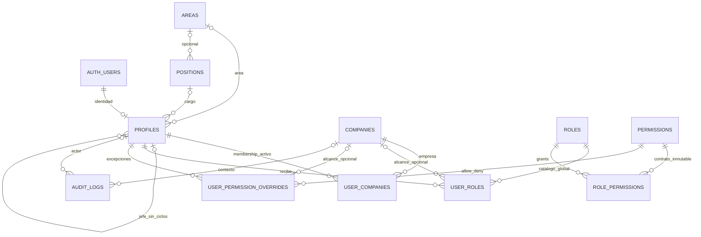

# Arquitectura base de seguridad — Fase 2

Base API aprobada: Node 24.18.0, Express/TypeScript, Supabase Auth/PostgreSQL y un Web Service Render. La [Fase 3](fase-3/README.md) añade frontend y maestros; este documento conserva el modelo de seguridad que reutiliza. No hay contabilidad ni operaciones financieras productivas. La visión futura se encuentra en [Fase 2.5](fase-2.5/README.md).

## Modelo

| Tabla | Campos principales y restricciones |
|---|---|
| companies | UUID PK, legal_name, code único, tax_id, country_code, active, timestamps; UNIQUE(country_code,tax_id) |
| user_companies | PK(user_id,company_id), active, assigned_by, assigned_at |
| profiles | UUID PK/FK auth.users, email/username únicos, full_name, area_id/position_id/manager_id nullable, status, timestamps, created_by/updated_by; sin empresa única |
| areas | UUID PK, name, code único, description, active, timestamps |
| positions | UUID PK, name, area_id nullable, description, hierarchy_level nullable, active, timestamps |
| roles | UUID PK, name, code único, description, active, is_system, timestamps |
| permissions | UUID PK, module, resource, action, code único, description, active, scope, requires_company |
| role_permissions | PK(role_id,permission_id), created_at; fila = grant |
| user_roles | UUID PK, user_id, role_id, company_id nullable, assigned_by, assigned_at, created_at; UNIQUE NULLS NOT DISTINCT(user_id,role_id,company_id) |
| user_permission_overrides | UUID PK, user_id, permission_id, company_id nullable, effect allow/deny, assigned_by, assigned_at, reason, timestamps; UNIQUE NULLS NOT DISTINCT(user_id,permission_id,company_id) |
| audit_logs | UUID PK, actor user_id, category/action, entity_type/entity_id, old/new JSONB, company_id, reason, auth_session_id, ip_address, user_agent, created_at |
| system_settings | una fila, system_name/timezone, updated_at; no secretos |

Tablas internas sin acceso Data API: private.user_provisioning (idempotencia/estado), private.email_changes (intenciones autorizadas de cambio de correo). Los assigned_by históricos/bootstrap pueden ser NULL; nuevas RPC siempre usan auth.uid(). UUID/FK RESTRICT, timestamptz e índices por membresía/empresa/actor. Retiro de membership marca inactive; no elimina historial. Overrides inherit elimina vínculo y conserva motivo en audit_logs.

## Resolver

private.resolve_permission es interno, sin EXECUTE para roles API. private.has_permission(code,company_id) y public.has_permission resuelven sólo auth.uid(). Primero: sesión Auth vigente, profile activo, permiso activo y membership/empresa activos cuando hay contexto. Permisos requires_company no funcionan sin company_id.

Precedencia: cualquier DENY aplicable (global o empresa) > ALLOW aplicable > grants de roles activos globales o de esa empresa > DENY default. Un ALLOW empresarial no vence a un DENY global; un ALLOW global no vence a un DENY empresarial.

Los roles son catálogo global; sus asignaciones tienen empresa o NULL explícito. Tesorería en A no concede facultades en B. No se infiere company_id desde perfil ni se confía en el identificador enviado por UI. roles/overrides scoped tienen FK a la membresía y trigger que exige active al asignar. Una membresía revocada anula capacidades al instante; reactivarla restaura las asignaciones conservadas.

Un rol financiero GLOBAL o ALLOW global, elegidos explícitamente con NULL, se aplican en todas las empresas activas autorizadas del usuario. Reservar NULL normalmente para roles de plataforma. La API exige company_id explícito, incluso cuando sea NULL, para no convertir omisiones en alcance global.

## Capacidad administrativa

- role.create/role.edit: metadata de roles.
- role.assign: asignar/retirar rol ya configurado, sin permission.assign adicional.
- permission.assign: configurar grants y overrides, sin exigir permisos de ejecución financiera al actor.
- user.disable: endpoint dedicado de estado, sin user.edit adicional.
- Sin autoedición de asignaciones, overrides, memberships ni grants de roles propios; cambios organizacionales propios también se bloquean porque afectan view_area.
- is_system no se acepta en RPC/formulario; no se convierte un rol normal en sistema. Roles sistema protegen código/estado y no reciben grants financieros.
- Un bloqueo transaccional común serializa mutaciones administrativas y protege al último administrador efectivo. Trigger separado serializa jerarquía y evita ciclos; ambos requieren READ COMMITTED.

Catálogo permissions exclusivo de migraciones/seeds; id/code/resource/action/scope/requires_company inmutables. No hay endpoint de escritura de catálogo. permission.manage queda retirado históricamente; se usa permission.assign.

## Recursos futuros

scope: none/own/area/company/all_authorized. request.view_own exige propietario; view_area exige área coincidente no nula; view_company exige empresa seleccionada; view_all abarca sólo empresas autorizadas donde el usuario tenga ese permiso. Todos mantienen membership y permisos en la empresa de la fila. DENY se aplica por código exacto, no veta implícitamente otras variantes de alcance.

contracts.ts y canReadRequest preparan el contrato; no existen aún tablas ni rutas financieras. Cuando existan, company_id se obtendrá de la fila persistida y las FK de relaciones entre recursos deberán incluir empresa. El área/cargo/jefe actual es global por profile; si una persona tiene organización distinta por empresa, hará falta otro ajuste antes de implementar ese caso.

## Límites de confianza

SUPABASE_PUBLISHABLE_KEY en Auth/request-scoped. SUPABASE_SECRET_KEY sólo en configuración servidor y auth-admin.ts. El cliente privilegiado no se exporta: sólo crear identidad reservada, cambiar correo autorizado, cerrar sesión y registrar éxito verificado. No hace CRUD corriente. Secret key omite RLS; grants revocados son una defensa adicional, no una garantía de aislamiento.

La única RPC de login record_authentication_success se concede exclusivamente al rol PostgreSQL service_role usado por secret keys nuevas; anon/authenticated no pueden ejecutarla. Verifica auth.sessions/profile y fija category/action. No admite actor arbitrario desde HTTP, resultado, user_agent confiable ni texto libre. Fallos se registran por Supabase Auth. user_agent administrativo queda NULL; IP sólo para éxito de login con trust proxy explícito.

RLS: lecturas propias activas o permisos administrativos globales. Categoría finance requiere audit.finance_view en company_id y membership. Mutaciones directas a tablas denegadas incluso al administrador; las RPC verifican autorización dentro de PostgreSQL y auditan en la misma transacción. Esquema private no expuesto.

## Riesgos y decisiones pendientes

- Concesiones recíprocas entre administradores o administración de identidades pueden dar acceso indirecto a terceros privilegiados. La separación asignar/ejecutar impide privilegios implícitos, no colusión ni compromiso de cuentas administrativas. Doble aprobación/MFA reforzado no se añadió sin decisión funcional.
- Auditoría técnica y administración son globales e incluyen PII. No constituyen aislamiento absoluto de administradores entre razones sociales.
- Provisión Auth y DB no es atómica entre servicios. Reserva idempotente y reintento completan el trabajo; identidad huérfana sin profile no accede. Limpieza excepcional requiere revisión.
- Cambios de correo de profiles existentes exigen intención administrativa reciente; autoservicio de email no está implementado.
- Supabase alojado, SMTP y Render pendientes de configuración/verificación externa. Los tests locales usan fixtures auth.users/auth.sessions; no sustituyen el servicio Auth real.

Consultar [README](../README.md), [endpoints](endpoints.md) y [verificación](fase-2.md).
