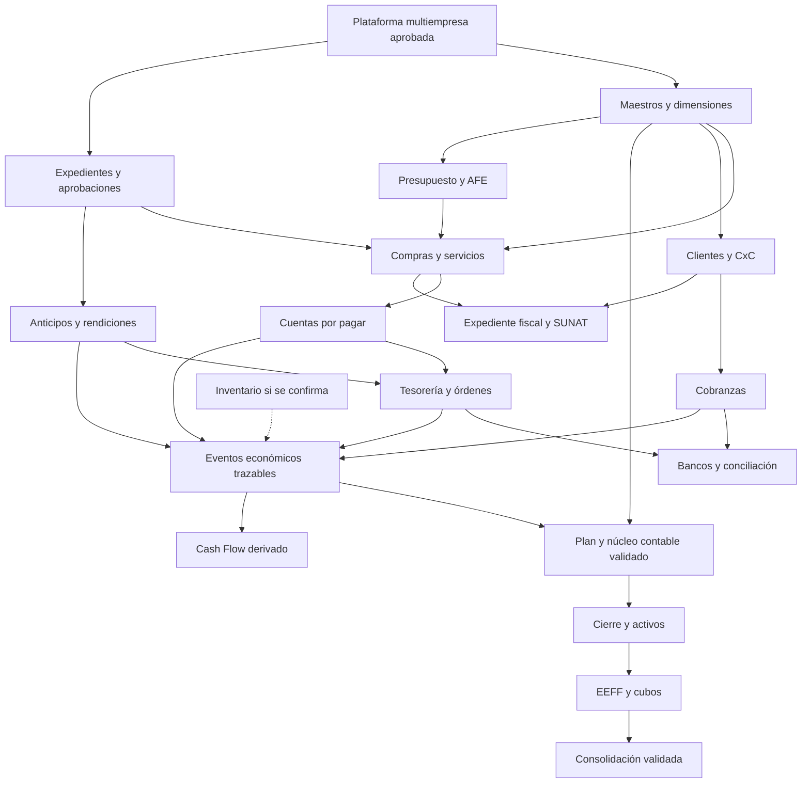

# 1. Mapa ERP, dominios y principios

**Diseño conceptual, 9 de septiembre de 2026.** Las fases 1–2 permanecen aprobadas e intactas. El objetivo futuro pasa a ser sustituir progresivamente Ábasoft; el estado implementado sigue siendo la plataforma administrativa de fase 2. No se asume acceso a la base, manuales o exportaciones de Ábasoft: las funciones observadas son las descritas por el usuario, pendientes de contrastar con datos y operación real.

## 1.1 Mapa funcional completo

| Contexto delimitado | Propietario de información y responsabilidad | No debe convertirse en |
|---|---|---|
| Plataforma existente | Identidad, empresas, memberships, organización, RBAC, auditoría técnica | Autorizador financiero por cargo o nombre |
| Maestros financieros | CECO, proyectos/subproyectos, unidades, dimensiones, monedas, referencias de terceros | Textos libres dispersos |
| Terceros | Proveedores, clientes, trabajadores y cuentas de beneficiarios por empresa | Usuario Auth obligatorio para todo trabajador |
| Solicitudes y aprobaciones | Necesidad, expediente, decisión y versiones de autorización | Pago ejecutado o asiento |
| Compras y servicios | OC/OS, entregas, conformidades, contratos y renovaciones | CxP creada automáticamente por cada proyección |
| Cuentas por pagar | Obligación confirmada, cuotas, vencimientos, aplicación de anticipos/notas | Registro del movimiento bancario |
| Tesorería | Órdenes, programación, lotes, ejecución, fondos, desembolsos y recuperaciones | Contabilidad o conciliación por el solo hecho de pagar |
| Bancos y conciliación | Extractos observados, correspondencias, diferencias y cierre de conciliación | Segunda ejecución de pagos importados |
| Clientes y CxC | Obligaciones comerciales, membresías comerciales, ventas y cuotas de lotes | user_companies o control de usuarios |
| Cobranzas | Abonos, identificación, aplicación/reversión de cobros | Conciliación bancaria automática |
| Gastos de personal | Viajes, anticipos, rendiciones, evidencias, DJ, devoluciones y reembolsos | DJ equiparada a comprobante tributario |
| AFE y presupuestos | Límites aprobados, compromisos, ejecución y disponibilidad | Saldos editados manualmente sin movimientos |
| Núcleo contable | Planes, documentos, partida doble, contabilización y reversos | Estado paid/provisioned de una factura |
| Activos y cierre | Altas, libros, depreciación futura, tareas COG, bloqueo/reapertura de períodos | Fórmulas contables no confirmadas |
| EEFF y análisis | Modelos versionados, saldos derivados, drill-down, cubos, comparativos | Libro contable paralelo |
| Proyección y Cash Flow | Escenarios, presupuestos y vistas actual/committed/forecast | Reingreso manual de cobros/pagos reales |
| Fiscal/SUNAT | Expediente tributario, CPE, XML/CDR, envíos, respuestas y registros | Autoridad que reemplaza el estado externo SUNAT |
| Inventario condicional | Productos, almacenes, movimientos y saldos si se confirma necesidad | Suposición de que COG significa costo de ventas |
| Transición e integración | Staging, mapeos, importación/exportación, conciliaciones de migración | Escritura directa a tablas productivas o doble fuente de verdad |

Se recomienda un **monolito modular** sobre el stack aprobado: cada dominio posee sus reglas y comandos; otros lo consultan mediante contratos. No hay evidencia para microservicios, un data warehouse separado ni otro proveedor. PostgreSQL es inicialmente fuente operativa y analítica. Procesos prolongados podrán requerir un worker con cola persistente cuando volumen/SLA lo justifiquen, sin rediseñar ahora el Web Service.

## 1.2 Dependencias

Las flechas siguientes indican prerequisitos de implementación, no que la fecha de contabilización tenga que seguir a la conciliación.

No crear una dependencia circular AFE–compras: una autorización AFE aprobada se consulta al comprometer; los eventos posteriores actualizan su lectura de consumo. No hacer que el motor contable dependa de pantallas de pagos: consume eventos documentados, con reglas de contabilización versionadas y aprobadas. Durante transición, esos eventos pueden exportarse a Ábasoft en vez de postear en el nuevo ledger.

## 1.3 Fronteras y contrato de eventos

Cada comando sensible futuro se ejecutará con identidad verificada, permiso empresarial, estado esperado y versión del agregado. Efecto + evento de dominio + auditoría se confirman juntos. Eventos conceptuales: `OrderApproved`, `ServiceAccepted`, `PayableConfirmed`, `PaymentExecuted`, `CollectionAllocated`, `ExpenseReportAccepted`, `RefundReceived`, `JournalPosted`, `PeriodClosed`.

El sobre incluye company_id, event_id, aggregate_id/type, aggregate_version, event_type/version, effective_date, recorded_at, actor, correlation_id y referencias tipadas. `outbox_events`/`processed_events` conceptuales permiten reintentos idempotentes; no prometen entrega exactamente una vez. Un consumidor rechaza un evento repetido mediante clave única y conserva la política/versiones usadas. Un error de integración genera pendiente visible, no pierde una operación bancaria ya real.

Datos fuente se fijan al aprobar/ejecutar: beneficiario, cuenta validada, moneda, importe y versión de aprobación. Cambiarlos requiere una nueva aprobación. El acceso a archivos será por vínculo empresarial y URL temporal, no bucket público; importaciones/XML se validan como datos, no instrucciones ni código ejecutable.

## 1.4 Multiempresa y seguridad

Dos contextos conocidos: empresa vinculada al Country Club (razón social/RUC aún por confirmar) e Inmobiliaria y Construcciones Cincinnati S.A.C. No crear registros legales ni inventar RUC. Todos los hechos operativos/financieros, sus líneas, aplicaciones y adjuntos relevantes llevan company_id. Catálogos globales técnicos como monedas son la excepción explícita, sin saldos empresariales propios.

Cada FK entre entidades empresariales deberá incluir `(company_id, id)` o una comprobación equivalente transaccional demostrada. Prohibir que una cuota A se aplique a un pago B, aunque el usuario pueda acceder a ambas empresas. Las únicas relaciones cruzadas permitidas son acuerdos intercompany explícitos: dos hechos legales independientes y vínculo de correspondencia, no una FK ordinaria que omita empresa.

Se reutilizan sin cambios has_permission(code, company_id), user_companies.active, roles scoped y precedencia DENY > ALLOW > roles > DENY default. Contexto seleccionado no es autorización. En accesos por ID, company_id se toma del recurso persistido; agregados/exportaciones también verifican todas las empresas. Una consulta consolidada se rechaza si falta acceso al perímetro completo, o se etiqueta inequívocamente como agregado parcial autorizado; nunca simula un consolidado completo.

**Cargo y rol son ramas diferentes del usuario:** cargo describe organización; user_roles concede permisos. Los nombres propios del proceso actual sirven sólo para entrevistas. Jefatura financiera, tesorería, coordinación financiera, contabilidad y cobranzas se convierten en responsabilidades configurables, no reglas ligadas a personas. Administrador TI no recibe permisos financieros nuevos automáticamente.

La plataforma tiene áreas globales por profile. Conceptualmente `company_areas(company_id, area_id, active, valid_from, valid_to)` habilitará áreas de operación por empresa; no altera ahora profiles ni asigna permisos. `strategic_units` será maestro empresarial. Una organización personal distinta en cada empresa requerirá definición adicional, no reinterpretar silenciosamente profile.area_id.

## 1.5 Fuente de verdad y prevención de duplicidad

| Dominio/hecho | Fuente actual durante transición | Fuente futura aprobada | Qué es sólo derivado/evidencia |
|---|---|---|---|
| Seguridad | Plataforma fase 2 | Plataforma fase 2 | Menú, caché de permisos |
| Maestros financieros | Ábasoft y fuentes que Finanzas identifique | Maestro del ERP por dominio/empresa al corte | Mapeos y exportaciones |
| Solicitud/orden/conformidad | Sistema designado por fecha de corte | Compras/servicios ERP | Adjuntos, notificaciones |
| Obligación CxP/CxC | Ábasoft hasta corte del subledger | Subledger ERP | Cuotas/saldo calculado, aging |
| Ejecución/cobro registrado | Sistema designado de tesorería/cobranzas | payments/collections y hechos financieros tipados | Orden de pago, identificación, conciliación |
| Movimiento bancario observado | Extracto del banco | bank_transactions conserva copia inmutable y origen | Matching no crea otra entrada de dinero |
| Contabilidad y períodos | Ábasoft hasta aceptación del cierre paralelo | journal_entries/lines posted y períodos ERP | Saldos, EEFF, cubos |
| Cash Flow real | Registros actuales reconciliados | Hechos de caja y vistas derivadas | No tabla de edición independiente de ingresos/egresos |
| Presupuesto/forecast/AFE | Versión aprobada que se recopile | Versiones autorizadas de cada dominio | Comparativos, disponible |
| Activos/depreciación | Ábasoft/proceso documentado | Subledger de activos + asientos ERP | Resúmenes y tareas de cierre |
| Estado tributario externo | SUNAT/OSE según modalidad real | Sigue siendo autoridad externa | Estado local sincronizado y expediente conservado |
| Histórico anterior al corte | Ábasoft y exportación controlada | Archivo verificable + referencias ERP | No reconstrucción aproximada de asientos faltantes |

Existirá una matriz `empresa × dominio × fecha efectiva × sistema escritor`, aprobada en cada corte. La coexistencia no autoriza dos sistemas a originar el mismo pago, venta o asiento. Integraciones transportan hechos con origen, no crean otro hecho económico.

Riesgos principales de duplicidad: OC y factura creando dos obligaciones; orden y pago sumados como egresos; abono importado y cobranza duplicando efectivo; forecast recurrente que no se sustituye por obligación confirmada; anticipo y rendición contados dos veces; carga de CxP abierta que repostea un saldo de apertura; una cuenta mapeada dos veces al mismo rubro; join de múltiples dimensiones multiplicando importes. Cada control específico está desarrollado en los modelos y el plan de migración.

## 1.6 Auditoría transversal

Todo evento sensible conservará actor, fecha efectiva/registro, empresa, acción, entidad, old_values/new_values, motivo, origen, referencia y correlación. Finanzas usa category=finance y permisos empresariales existentes; no oculta importes bajo auditoría técnica. Eventos de integración identifican al servicio y responsable de la autorización, no fabrican un usuario humano.

Conservar alta/baja CECO, cambio de cuenta, autorización bancaria, AFE/presupuesto, ejecución, reverso, conciliación, cierre/reapertura y versiones de reportes. Un estado contabilizado o conciliado no se corrige eliminando historia. Retención y acceso a PII/adjuntos se acuerdan antes de migrar; no se fija un plazo legal inventado.
