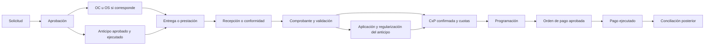

# 2. Modelo operativo y workflows

**Sólo diseño.** Los nombres de tablas son candidatos conceptuales, no migraciones. Todas las entidades empresariales incluyen UUID, company_id, created_at/updated_at, actor y referencia de origen cuando aplique; las tablas hijas también llevan company_id para integridad y RLS. Importes usan DECIMAL/NUMERIC y moneda explícita. No hay autorización por nombre de persona.

## 2.1 Terceros, documentos y aprobaciones

| Entidad conceptual | Datos y relaciones esenciales |
|---|---|
| suppliers | Identidad legal y tributaria, tipo/número de documento, razón social, nombre comercial, dirección, contactos, payment_term_id, status; único por empresa + país + tipo/número legal cuando exista |
| supplier_bank_accounts | supplier_id, banco, moneda, número/CCI, titular, vigencia, versión, status, requested_by, approved_by; cuenta propuesta no sustituye la aprobada |
| supplier_bank_account_changes | Versiones anterior/propuesta, motivo, evidencia de verificación, solicitante/revisor, decisión; revisión independiente |
| customers | Identidad legal/contactos empresariales; varias obligaciones por cliente |
| employees | Trabajador/beneficiario empresarial, identificador externo, profile_id opcional; no todo trabajador necesita acceso Auth |
| counterparties | Identidad empresarial común, con extensiones supplier/customer/employee; evita FK polimórficas sin validar y mantiene roles explícitos |
| financial_documents | Registro canónico de documento fuente, issuer/counterparty, tipo, serie/número, fechas de emisión/recepción, moneda, importes, versión y estado documental |
| document_files / document_relations | Hash/tamaño/MIME/ruta privada, tipo de evidencia, vínculos tipados a expedientes; una carga no vuelve a crear el documento financiero |
| approval_policies / approval_steps | Empresa, tipo de proceso, vigencia, versión, umbrales/monedas y responsables por rol; límites definitivos pendientes |
| approval_instances / approval_decisions | Expediente/versionado aprobado, paso, actor, fecha, decisión y motivo; política y contenido congelados para trazabilidad |

Se prefiere maestro de terceros por empresa con correlación externa opcional entre empresas, en lugar de compartir cuentas bancarias y condiciones indiscriminadamente. El diseño de counterparties es un supertipo: suppliers y customers siguen siendo maestros explícitos y la pertenencia del subtipo debe validarse. RUC y datos de titular se confirman con el negocio; no se fusionan terceros sólo por similitud de nombre.

Documento tributario, archivo PDF/XML, evidencia de pago y expediente contable son objetos distintos. Una captura Yape/Plin acredita evidencia a evaluar, no clasificación tributaria automática. Referencias documentales son tipadas; source_entity_type/id sólo dan trazabilidad, no reemplazan FK y validación empresarial.

## 2.2 Compras, servicios y obligaciones

| Entidad | Datos específicos / relaciones |
|---|---|
| purchase_requests / purchase_request_items | Solicitante, área/unidad, necesidad, cantidades, estimados, moneda, imputaciones, AFE, adjuntos, revisión y aprobación |
| purchase_orders / purchase_order_lines | Proveedor, código/versionado, cantidades, precios, moneda, condiciones, fechas, referencias a líneas aprobadas |
| service_orders / service_order_lines | Alcance/entregables, proveedor, hitos, plazos, moneda, monto, contrato y solicitud; OS diferente de recepción física |
| goods_receipts / goods_receipt_lines | OC/líneas, cantidad recibida/rechazada, responsable y fecha; recepción no presupone inventario valorizado |
| service_acceptances / service_acceptance_items | OS/contrato/hito, prestación, monto/cantidad aceptados, observaciones, evidencias y conformante |
| invoice_lines / document_matches | Detalle del documento fuente, impuestos como clasificación pendiente de política, match N:M a orden/conformidad; evita duplicar financial_documents |
| payables | Acreedor, documento/obligación origen único, importe confirmado, moneda, estado, fecha de reconocimiento operativo, condiciones congeladas |
| payable_installments | payable_id, número de cuota, principal/otros conceptos separados, vencimiento explícito y método que lo originó; saldo por aplicaciones |
| payment_terms / payment_term_rules | Contado, anticipado, plazos 7/15/30/45/60, fecha fija, fin de mes o reglas personalizadas; empresa y vigencia |
| obligation_adjustments / advance_applications | Notas/ajustes aprobados, aplicación de anticipos a obligaciones, monto/moneda, origen y reverso |

`due_date_basis`: invoice_date, document_received_date, service_acceptance_date, contract_date, explicit_date. Guardar base elegida, fecha base, regla/versionado, cálculo y fecha resultante. Si falta la fecha base, marcar vencimiento pendiente: no inventar fecha factura. Calendarios, días hábiles, fin de mes y cuotas se validarán con Finanzas; no hay fórmula tributaria implícita.

Este diagrama refleja la secuencia operativa frecuente; comprobante y prestación pueden recibirse en otro orden y conservarán sus estados independientes. La contabilidad se activa por evento de reconocimiento aprobado, no debe esperar necesariamente al pago o a la conciliación. La aceptación de servicio sin factura puede originar una provisión según política pendiente, no una cuenta inventada.

Anticipo a proveedor se identifica como anticipo, no como cancelación de una CxP aún inexistente. La regularización consume su importe mediante advance_applications y puede dejar diferencia pagable/recuperable. Anular una orden con pago real exige tratar ese anticipo/recuperación, no eliminar el pago.

## 2.3 Contratos y recurrencia

`contracts`: proveedor/cliente según contrato, objeto, vigencia, moneda, importe/regla, hitos, prórrogas/versiones, documentos y responsables. `recurring_services`: contract_id, concepto, periodicidad configurable, fechas y regla de generación. `recurring_obligations`: servicio/período/hito, fecha prevista, importe estimado, moneda, status, payable_id opcional y clave de generación única.

Separar `projected` de `confirmed`: confirmar crea/vincula una sola obligación CxP y sustituye esa previsión en Cash Flow; no sumar ambas. Cambiar contrato conserva proyecciones históricas/versiones. Reintentar la generación no duplica obligaciones. Ningún proceso recurrente ejecuta pagos bancarios por sí solo.

## 2.4 Tesorería y bancos

| Entidad | Datos y cardinalidad |
|---|---|
| banks / bank_accounts / funds | Banco de referencia; cuenta de empresa, moneda, titular, identificador, vigencia; fondo/caja autorizado y trazabilidad del responsable |
| payment_orders | Tipo, beneficiario, modo de pago, fecha_registro/fecha_giro/vencimiento, cuenta_origen, fondo, moneda, monto derivado, estado, creado/aprobado por y versión aprobada |
| payment_order_items | Orden, obligación/cuota/anticipo/reembolso objetivo, importe, documentos, AFE/CECO/proyecto e imputaciones; total = suma de líneas |
| payment_batches / payment_batch_items | Lote operativo por empresa/cuenta/moneda compatible, órdenes, totales de control, estado y referencias de archivo bancario; no otro pago |
| payments | Ejecución real, orden/anticipo origen, beneficiario y cuenta validados en snapshot, importe/moneda, cuenta origen, fecha efectiva, referencia/idempotencia externa, execution_status |
| payment_allocations | Pago ↔ cuota/obligación elegible N:M; importe en moneda del pago y de la obligación, tasa aplicada, versión, reverso; no excede saldo disponible |
| bank_import_batches / bank_transactions | Archivo/fecha/hash, cuenta y línea externa única, fecha operación/valor, entrada/salida, importe/moneda, referencia y texto original; inmutables tras conciliación |
| financial_transactions | Identificador común tipado de hecho de caja; referencia exclusiva a payment/collection/refund/return/transfer/ajuste autorizado; no importe reingresado ni otra fuente editable |
| bank_reconciliations / reconciliation_matches | Cuenta/período, saldo inicial/final observado, responsable/revisor; matches N:M entre bank_transaction y financial_transaction con importes y reversos |
| bank_transfers / bank_adjustments | Transferencia con dos patas vinculadas; comisiones/intereses u otros hechos sin pago previo necesitan registro autorizado, no creación automática por matching |

La orden organiza y autoriza; payment registra ejecución. Lote sólo agrupa. Una orden puede ejecutarse parcialmente; una ejecución puede aplicar a varias cuotas compatibles. En el primer alcance, la orden tiene un beneficiario y moneda; si un lote agrupa beneficiarios, conserva órdenes distintas. No mezclar empresas dentro de un pago/lote.

Ante respuesta bancaria incierta, estado `unknown` y consulta/conciliación antes de reintentar; nunca reenvío ciego de una transferencia. Si el banco debitó pero la aplicación falló, registrar excepción y recuperar con referencia bancaria. Doble control bancario no se sustituye por un checkbox UI.

Matching y reconciliación son distintos: cada lado conserva saldo residual, matches no superan importes y el cierre valida movimientos/saldos. Una diferencia, comisión o tipo de cambio necesita evento explícito. `excluded` exige motivo y aprobación según política; no significa borrar ni ocultar el movimiento al revisar el cierre. Reabrir una conciliación conserva versión anterior y reversa matches autorizadamente.

## 2.5 CxC, membresías comerciales y lotes

`receivables`: cliente, contrato/documento/concepto, importe/moneda, estado y referencia única de obligación; `receivable_installments`: cuotas y vencimientos; `collections`: ingreso observado/registrado, importe/moneda, fecha, cuenta, referencia bancaria, estado de identificación; `collection_allocations`: cobro ↔ cuota N:M, importes aplicados y reversos.

No exigir cliente conocido para registrar el abono: `unidentified → identified → partially_allocated → allocated`, con diferencias/no aplicado visibles. Identificar cliente/operación no reconoce por sí solo ingreso contable. El dinero no aplicado puede permanecer pendiente; no forzar una factura o cliente ficticio. Revertir aplicación no elimina el movimiento bancario ni duplica un cobro.

Preparar explícitamente `commercial_memberships`, `membership_plans`, `membership_dues`: cliente/socio, vigencia, contrato, reglas/versiones de cuotas. **No reutilizar user_companies**, que es seguridad. Para inmobiliaria: `properties`, `lots`, `lot_sale_contracts`, `sale_installment_schedules`; identificadores empresariales, proyecto, cliente, contrato, moneda y cronograma. Titularidad, transferencias, moras, reconocimiento de ingresos, reservas y anulaciones son decisiones pendientes. Un lote no se convierte automáticamente en producto de inventario ni un cobro en venta devengada.

Workflow: abono bancario → ingreso no identificado → identificación cliente/contrato → aplicación a cuotas → conciliación independiente. Cobranzas identifica/aplica; tesorería concilia bajo segregación. La misma bank_transaction alimenta el cobro por vínculo, sin generar dos hechos de caja.

## 2.6 Viáticos, rendiciones, DJ y recuperaciones

| Entidad | Datos y relaciones |
|---|---|
| travel_requests | Empleado, motivo/itinerario, fechas, estimados, imputaciones y aprobación; no exige anticipo |
| expense_advances | Empleado/solicitud, monto/moneda aprobados, payments de desembolso, fecha límite y estado; desembolsos parciales identificables |
| expense_reports / expense_report_items | Expediente y líneas de gasto, fecha/concepto, importe/moneda, importe presentado/aceptado/rechazado, imputaciones, vínculo a anticipos mediante aplicaciones |
| expense_evidences | Ítem ↔ archivos/documentos N:M, clase tributaria/pago/interna, verificación; no equivale a aceptación del gasto |
| sworn_declarations / sworn_declaration_items | Declarante, hechos/items, moneda/importes, motivo, expediente vinculado, firma/versión y revisión; PDF futuro derivado de una versión firmada |
| expense_settlements / expense_settlement_allocations | Rendición aceptada, anticipos aplicados, devoluciones y reembolsos; evita asociar un anticipo íntegro a dos rendiciones |
| employee_returns | Empleado, anticipo/liquidación, importe esperado/recibido, evidencia y financial_transaction de entrada |
| employee_reimbursements | Empleado, liquidación aprobada, importe por reembolsar, CxP/orden/pago asociados; no otro egreso al cerrar |
| vendor_refunds | Proveedor, operación original, motivo, original_amount, claimed_amount, agreed_refund_amount, moneda, acuerdo/versionado, resolution_type, aprobado por/fecha |
| vendor_refund_receipts | Recuperación recibida, fecha/moneda, banco/evidencia y financial_transaction único |
| vendor_refund_allocations | Receipt ↔ acuerdo/caso, importe aplicado, reverso; permite varios recibos por acuerdo sin duplicar caja |

Rendición: solicitud/viaje → aprobación → desembolso opcional → gastos → presentación → revisión → aceptación → liquidación → devolución o reembolso → cierre. Gastos observados no consumen automáticamente el anticipo como aceptados; pagos sin sustento quedan visibles. El tratamiento de montos rechazados requiere política expresa.

Ejemplos funcionales en una misma moneda, sin tasas ni cuentas inventadas:

- Anticipo 180, gasto aceptado 160: saldo a devolver 20. Una devolución recibida de 20 permite saldo 0; no se crea otro gasto de 20.
- Anticipo 180, gasto aceptado 205: reembolso autorizado 25. La ejecución de esos 25 cierra la diferencia, sin duplicar los 205 como desembolso nuevo.
- Proveedor: original 2,000, reclamo identificado, acuerdo 1,200, recibido/aplicado 1,200. `remaining_agreed_amount=0`; cierre autorizado con `partial_refund_accepted`, aunque el original sea mayor. Compra conservada -2,000, recuperación +1,200, impacto neto de caja -800. No se infiere de ello una cuenta contable ni tratamiento tributario.

`received_amount` procede de receipts/aplicaciones válidas; `remaining_agreed_amount = agreed_refund_amount − received_amount`. El cierre no compara contra original_amount. Cambiar acuerdo luego de recibir exige nueva versión y autorización. Sobre-recuperaciones/diferencias se investigan; no se fuerzan a cero. Si aún no hay acuerdo, el remanente acordado es indeterminado, no cero que permita cerrar.

## 2.7 Estados y controles de transición

Catálogos/reglas serán versionados, no ENUM de roles ni reglas por nombres. Propuesta a validar:

| Agregado | Estados/workflow | Control que cambia el estado |
|---|---|---|
| Proveedor/cliente | draft → validated → active → inactive | Identidad revisada; desactivar no borra operaciones |
| Cuenta proveedor | proposed → pending_review → approved/rejected → superseded | Quien propone no aprueba; evidencia y snapshot de cuenta |
| Solicitud | draft → submitted → observed/rejected/approved → fulfilled/cancelled | Crear ≠ aprobar; cambios relevantes invalidan aprobación |
| OC/OS | draft → submitted → approved → issued → partially_fulfilled → fulfilled → closed | Referencias y cantidades; cancelación trata compromisos/anticipos |
| Recepción/conformidad | draft → submitted → observed/rejected/accepted → reversed | Responsable competente; aceptación parcial explícita |
| Documento | received → under_review → observed/validated → superseded | Clasificación documental independiente de pago/contabilidad |
| CxP/CxC | draft → confirmed → partially_settled → settled; disputed/cancelled con control | Confirmación no prueba pago; saldo derivado de aplicaciones |
| Contrato | draft → reviewed → active → suspended/expired/terminated | Versiones y obligaciones ya generadas conservadas |
| Obligación recurrente | projected → confirmed/cancelled | Confirmación enlaza único payable; no ejecución automática |
| Orden de pago | draft → submitted → approved → scheduled → partially_executed → executed → closed | Aprobación congelada; anulación no borra ejecución |
| Pago | prepared → approved → submitted_to_bank → executed/failed/unknown → reversed | Referencia/idempotencia; unknown impide reenvío automático |
| Lote | draft → validated → approved → submitted → partial/completed/failed | Estados agregados de ítems, nunca saldo independiente |
| Movimiento banco | unmatched → partially_matched → matched → reconciled; excluded con motivo | Matching por importe; conciliador independiente |
| Conciliación | draft → in_review → closed → reopened | Cuadre y diferencias justificadas; historial de reapertura |
| Cobranza | unidentified → identified → partially_allocated → allocated → reversed | Identificación ≠ conciliación; reversar aplicación conserva caja |
| Anticipo | draft → submitted → approved → partially_disbursed/disbursed → settling → closed | Desembolso real y saldo liquidado, no sólo archivo adjunto |
| Rendición | draft → submitted → observed → reviewed → accepted → settled → closed | Aceptado ≠ pagado; separar líneas rechazadas |
| DJ | draft → signed → submitted → observed/accepted/rejected | Firma/versión inmutable; PDF posterior reproduce datos firmados |
| Devolución empleado | expected → received → verified → applied → closed | Evidencia y entrada real; conciliación en eje separado |
| Reembolso empleado | requested → reviewed → approved → scheduled → paid → closed | Pago por tesorería y aplicación, no doble egreso |
| Recuperación proveedor | draft → claimed → under_negotiation → agreed → partially_received/received → closure_pending → closed | Registrar recibido ≠ aprobar cierre parcial; acuerdo es base |

Estados documental, aprobación, obligación, ejecución, conciliación y contabilidad son ejes separados. Ejemplo válido: documento complete, pago paid, contabilidad pending. `provisioned` describe un reconocimiento/provisión con referencia; `posted` es el estado del asiento. No hacer `paid` equivalente a `posted` ni bloquear un asiento sólo porque aún no existe salida de banco.
