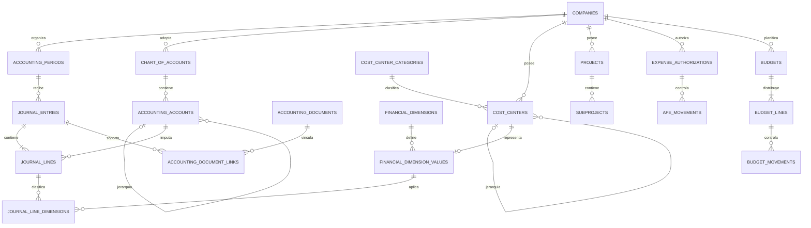

# Contabilidad, centros de costo y dimensiones

Documento conceptual: las entidades y campos siguientes no son migraciones ni contratos de API aprobados para producción. Los importes calculados son proyecciones de movimientos trazables; no se mantienen como saldos editables independientes.

## Núcleo contable

Toda entidad de hechos pertenece a una empresa. Las claves foráneas de detalle deben verificar también `company_id`, incluso cuando el UUID sea globalmente único. Las fechas de documento, devengo y registro no son intercambiables.

| Entidad | Campos conceptuales y responsabilidad |
|---|---|
| `accounting_periods` | id, company_id, year, month, start_date, end_date, status, closed_by/at, reopened_by/at, version. Un período por intervalo; sin solapamientos. |
| `chart_of_accounts` | id, company_id, code, name, version, valid_from/to, status, source_reference. Versiona el plan realmente adoptado por cada empresa. |
| `accounting_accounts` | id, company_id, chart_id, code, name, parent_id, level, account_type, nature, allows_posting, currency_control, active, external_abasoft_code, valid_from/to. Jerarquía sin ciclos; códigos únicos dentro del plan. |
| `journal_entries` | id, company_id, period_id, journal_type, entry_number, entry_date, document_date, description, currency_id, functional_currency_id, exchange_rate, source_module, source_type, source_id, status, created_by/at, validated_by/at, posted_by/at, reversed_by/at, reversal_entry_id. Añadir source_event_id, version y referencia de corrección para idempotencia y trazabilidad. |
| `journal_lines` | id, company_id, journal_entry_id, line_number, account_id, description, debit, credit, transaction_currency_id, transaction_amount, exchange_rate, functional_amount, counterparty_type/id, created_at. La contraparte debe referenciar el maestro tipado, no un identificador libre sin integridad. |
| `accounting_documents` | id, company_id, financial_document_id opcional, document_type, document_date, external_reference, evidence_reference, status. Representa el soporte contable, sin copiar la factura como nuevo saldo. |
| `accounting_document_links` | company_id, accounting_document_id, journal_entry_id, relation_type. Relación N:M: un documento puede originar reconocimiento, pago y ajustes distintos. |
| `accounting_source_links` | company_id, source_module/type/id, source_event_id, journal_entry_id, accounting_rule_version. Impide contabilizar dos veces el mismo evento; un evento puede generar varios asientos sólo mediante una partición explícita y única. |

`debit` y `credit` se expresan en moneda funcional. Cada línea tiene exactamente un lado positivo; `functional_amount = debit - credit` es una representación derivada con signo. `transaction_amount` mantiene ese signo en moneda de transacción. La cabecera identifica la moneda principal del documento; las líneas conservan la moneda real cuando una operación cruza monedas. No se suman importes de transacción de monedas distintas para verificar el balance.

### Estados y reglas obligatorias

`draft → validated → posted → reversed`. Una edición del borrador validado invalida su validación y requiere nueva revisión. `reversed` conserva el asiento original y enlaza el asiento compensatorio efectivamente posteado; no borra su efecto histórico. Una corrección es reverso más nuevo asiento, según la política que se confirme.

1. Al postear, suma del debe = suma del haber en moneda funcional, con redondeo controlado y precisión definida por moneda. No admitir descuadres mediante una tolerancia silenciosa.
2. Empresa, período, cuentas, contraparte y dimensiones deben ser compatibles. Sólo cuentas activas y que admiten movimiento para la fecha contable.
3. Período abierto y usuario autorizado al ejecutar la transacción. En `soft_closed`, sólo correcciones expresamente habilitadas por el flujo de cierre; `closed` bloquea contabilización ordinaria.
4. Asiento posteado inmutable, incluidos dimensiones, tasa y soportes que determinaron la contabilización. Se pueden añadir evidencias con historial, sin sustituir silenciosamente el soporte original.
5. Número de asiento único por empresa y serie definida; asignación transaccional. La regla de numeración y sus exigencias legales se validarán antes de producción.
6. Posteo, líneas, vínculo al origen y auditoría se confirman atómicamente. Reintentos no generan asientos adicionales.
7. Reverso autorizado, motivo obligatorio, relación explícita y período permitido. No reescribir un período cerrado para acomodar un reverso posterior.
8. Un pago no reconoce de nuevo el gasto ya provisionado; una conciliación no vuelve a registrar el movimiento de caja. Las reglas contables por evento se aprobarán con Contabilidad.
9. No eliminar cuentas, dimensiones ni documentos usados. Los cambios de vigencia conservan referencias históricas.
10. La separación creador/validador/posteador se aplica por operación y política; tener ambos permisos no elimina una incompatibilidad configurada.

## Plan de cuentas y versiones

Importar primero el plan de Ábasoft con su jerarquía, subcuentas y uso real. No generar un plan ficticio ni reemplazar automáticamente sus códigos. Proponer `account_equivalences` con cuenta origen/destino, propósito, vigencia, versión y aprobación para equivalencias entre empresas, planes y reportes. Una equivalencia no modifica asientos históricos.

Existe una actualización normativa relevante: la Resolución CNC 002-2026-EF/30, publicada el 4 de septiembre de 2026, aprueba el PCGE 2026 para entidades fuera de la supervisión de la SBS y dispone vigencia desde el 1 de enero de 2028, con posibilidad de aplicación anticipada. Por ello el modelo debe soportar versiones; la fecha de adopción de cada empresa y sus políticas requieren confirmación contable. [Resolución oficial](https://busquedas.elperuano.pe/dispositivo/NL/2550786-1).

## Centros de costo como maestro explícito

| Entidad | Campos |
|---|---|
| `cost_center_categories` | id, company_id o catálogo compartido explícito, code, name, description, active. Categorías configurables. |
| `cost_centers` | id, company_id, code, name, description, category_id, parent_id nullable, level, active, valid_from/to, created_by/at, updated_by/at. Código único por empresa. |
| `cost_center_hierarchy_versions` | id, company_id, version, valid_from/to, approved_by/at. |
| `cost_center_hierarchy_members` | hierarchy_version_id, cost_center_id, parent_id nullable, level. Conserva la estructura con la que se emitió cada reporte. |
| `cost_center_applicability` | company_id, cost_center_id, area_id/project_id/subproject_id opcionales tipados, valid_from/to. Reglas de uso compartido; no obliga a que un centro pertenezca a un único proyecto. |

La profundidad no está fijada a dos o tres niveles. Rechazar auto-parentesco, ciclos, padres de otra empresa e intervalos inválidos; proteger las comprobaciones frente a cambios concurrentes. `level` se deriva de la jerarquía, no se introduce libremente. La versión histórica evita que mover un centro cambie retroactivamente un EEFF aprobado. Los reportes indicarán si usan la estructura histórica o una reclasificación de presentación explícita.

Desde una UI futura se podrá crear centro raíz o subcentro, editar metadata permitida, asignar categoría y desactivar. Requiere `cost_center.create/edit/disable` y contexto empresarial validado; `cost_center.view` para consultar. Cada operación registra actor, fecha, empresa, motivo cuando corresponda y valores antes/después. El código usado queda protegido y un centro usado no se elimina. Desactivarlo bloquea usos nuevos desde su vigencia, pero permite consulta y reversos históricos controlados. No desactivar un padre dejando hijos operativos sin una decisión explícita.

OPEX/CAPEX no serán las únicas categorías codificadas. Una categoría organizativa no determina por sí sola capitalización ni cuenta contable; esa política pertenece a las reglas contables aprobadas.

## Proyectos, áreas y dimensiones

`projects`: id, company_id, code, name, description, status, start_date, end_date, created_by/at, updated_by/at. `subprojects`: id, company_id, project_id, code, name, description, status, created_by/at, updated_by/at. Código de proyecto único por empresa y subproyecto único dentro del proyecto. Estados propuestos `draft → active → closed`, con `inactive` administrativo; cerrar impide nuevos compromisos ordinarios, no consultar o corregir historia mediante un flujo autorizado. Nunca eliminar registros utilizados.

Permisos separados `project.view/create/edit/disable` y `subproject.view/create/edit/disable`. Área, unidad estratégica, proyecto y centro de costo representan ejes distintos. Las áreas actuales siguen siendo organizativas; una asociación `company_areas` validaría su aplicabilidad empresarial sin cambiar ahora el modelo de Fase 2. Los cargos no autorizan imputaciones.

| Entidad | Diseño |
|---|---|
| `financial_dimensions` | id, code, name, value_type, active. Catálogo del sistema: COST_CENTER, PROJECT, SUBPROJECT, AFE, AREA, STRATEGIC_UNIT; extensiones gobernadas. |
| `financial_dimension_values` | id, company_id, dimension_id, code, name, referencia tipada al maestro, active, valid_from/to. No duplicar el nombre/código del maestro como otra fuente editable. |
| `journal_line_dimensions` | company_id, journal_line_id, dimension_id, dimension_value_id, hierarchy_version_id cuando aplique. Única dimensión por línea. |
| `dimension_requirements` | company_id, account_id o grupo definido, operation_type, dimension_id, required, valid_from/to, policy_version. |

Se propone `COST_CENTER` como código canónico y `CENTER_COST` sólo como alias de importación si existe en un origen. No se renombra ningún contrato ya utilizado. Una referencia tipada debe validar integridad y empresa; no basta con un par de textos tipo/id.

La propuesta supera el campo único `journal_entry_lines.cost_center_id` mencionado en el requerimiento: `journal_lines` representa aquí las líneas del asiento y `journal_line_dimensions` contiene todos sus ejes analíticos. No habrá dos tablas de líneas ni dos imputaciones de CECO editables en paralelo.

Validar subproyecto dentro del proyecto, AFE y CECO compatibles y dimensiones obligatorias según cuenta/operación. Para repartir una operación entre varios centros se dividen importes en líneas con una distribución cuya suma sea el total original; no se repite el total en varias dimensiones. Las consultas deben evitar multiplicar importes al unir varias dimensiones.

## AFE y presupuestos

No se presupone el significado operativo exacto de AFE ni su fórmula vigente. `expense_authorizations`: id, company_id, code, area_id, project_id, subproject_id, cost_center_id, description, authorized_amount, committed_amount, executed_amount, available_amount, currency_id, valid_from/to, requested_by/at, approved_by/at, status, created_at, updated_at. Los importes de situación se calculan desde movimientos y se acompañan de versión/fecha de corte.

Estados conceptuales: `draft → submitted → approved → active → exhausted → closed`; alternativas `observed → draft`, `rejected`, `cancelled`. Aprobación y activación pueden coincidir sólo si la política lo permite. Agotar el importe no elimina compromisos pendientes; cancelar libera únicamente saldos liberables y conserva operaciones ejecutadas.

`afe_movements` identifica autorización, reserva, compromiso, liberación, ejecución o ajuste, documento origen, importe/moneda, tasa aplicada y evento único. Las ampliaciones se versionan y aprueban. La relación de AFE con presupuesto, tolerancias, sobregiros y quién puede aprobar son decisiones pendientes.

`budgets`: id, company_id, period/range, scenario, version, currency_id, status, approved_by/at. `budget_lines`: presupuesto, cuenta o categoría explícita, período y dimensiones, importe autorizado. `budget_movements`: línea, tipo, importe, moneda, origen, referencia al compromiso reemplazado, aprobación. Estados `draft → submitted → approved → active → closed`; modificaciones producen una nueva versión aprobada.

Como control conceptual, ejecutar un compromiso debe trasladar su importe de pendiente a ejecutado, sin consumirlo dos veces. Ejemplo ilustrativo, no fórmula aprobada: autorización 100, compromiso pendiente 30, ejecución de 20 contra ese compromiso ⇒ pendiente 10 y ejecutado 20; consumo total 30. Pagado es otro eje. La fórmula final de disponible dependerá de si el control incluye impuestos, tipo de cambio, devengo o caja y de cómo se manejan anulaciones.

## Monedas

`currencies`: código ISO, nombre, decimales admitidos, active. Preparar PEN y USD, sin restringir futuras monedas. `company_currency_policies`: empresa, moneda funcional, moneda de presentación opcional, vigencia y versión aprobada. Cambiar moneda funcional no es una edición retroactiva de configuración.

`exchange_rates`: id, rate_date, from_currency_id, to_currency_id, rate_type (compra/venta/contable u otro gobernado), rate, source, source_reference, version, created_by/at, approved_by/at si procede. Guardar en cada hecho la tasa efectivamente aplicada, dirección y referencia. Una tasa corregida genera versión; nunca recalcula silenciosamente historia posteada.

Propuesta técnica: decimales exactos para importes, por ejemplo `numeric(20,6)`, y tasas `numeric(24,12)`, sujetos a volúmenes reales y política de redondeo. No usar flotantes. Redondear al punto aprobado del proceso, conservar diferencia y tratamiento explícito. No sumar PEN y USD sin conversión documentada. La conversión bancaria ejecutada puede diferir de la tasa contable; ambas deben quedar identificadas. Revaluación, diferencias realizadas/no realizadas y reversos al siguiente mes requieren política contable antes de codificar fórmulas.

## ER conceptual del núcleo y las dimensiones

Las relaciones de dimensiones con otros maestros siguen el mismo patrón tipado de CECO. El diagrama simplifica campos y versiones; no elimina las restricciones empresariales descritas.
