# Cierre, reporting y dominios condicionados

## Cierre mensual

`accounting_close_processes`: id, company_id, period_id, version, status, owner_id, started_at, approved_by/at, closed_by/at. `accounting_close_tasks`: proceso, task_type, description, responsible_id, reviewer_id, due_date, dependencies, status, completed_by/at, reviewed_by/at, observations, evidence_reference. `accounting_close_history`: transición, actor, fecha, motivo y referencia; inmutable.

El período tiene estados `open → soft_closed → closed`. El proceso de cierre pasa por `draft → in_progress → under_review → approved → completed`; puede volver a revisión con observaciones. Las tareas pasan por `pending → in_progress → completed → reviewed`, con `observed` y `waived` únicamente si una excepción autorizada y motivada lo permite. Completar tareas no cierra automáticamente el período.

Checklist configurable inicial: documentos pendientes, CxP, cobranzas y CxC, conciliaciones bancarias, anticipos/rendiciones, provisiones, diferencias de cambio, depreciación, COG, análisis de cuentas, revisión de dimensiones y preparación/aprobación de EEFF. Cada tarea tiene responsable, evidencia y dependencia; no se fija una regla contable por su nombre.

El cierre verifica que no haya tareas obligatorias pendientes ni procesos contables en curso. Se debe serializar con el posteo para impedir que entre un asiento mientras el período se cierra. Una reapertura exige `accounting_period.reopen`, motivo, auditoría y aprobación según política; produce nueva versión del cierre y marca los reportes anteriores como versiones históricas, no los borra. Las correcciones requieren nuevo cierre y nueva aprobación de los reportes afectados.

## Activos y depreciación

| Entidad | Contenido conceptual |
|---|---|
| `fixed_asset_categories` | empresa, código, nombre, cuentas y reglas propuestas con vigencia/aprobación. No inferir tasas por categoría. |
| `fixed_assets` | id, company_id, code, description, category_id, acquisition_document_id, acquisition_date, in_service_date, original_cost, currency_id, residual_value, useful_life, location, custodian_id, cost_center_id, project_id, status, external_abasoft_code. Datos contables sujetos a política confirmada. |
| `depreciation_books` | activo, propósito contable/tributario u otro aprobado, moneda, método, vida útil, valor residual, vigencia y versión. Evita mezclar tratamientos diferentes. |
| `depreciation_runs` | empresa, período, libro, policy_version, status, prepared_by/at, reviewed_by/at, posted_by/at. |
| `depreciation_lines` | corrida, activo, base, importe del período, acumulado y saldo calculados, dimensiones, journal_entry_id. Única ejecución por activo/período/libro/versión efectiva. |
| `asset_movements` | alta, traslado, mejora, baja o corrección; fecha, soporte y autorización. No editar directamente saldos depreciados. |

Activo: `draft → reviewed → active → disposed`, con `suspended` si la política lo contempla. Corrida: `draft → prepared → reviewed → posted → reversed`. Los valores históricos de apertura se importan y concilian; no recalcular desde la compra sin validar que reproduce el origen. Antes de implementar, confirmar inventario de activos, métodos, vidas, residuales, inicio de depreciación, mejoras, bajas, componentes y separación contable/tributaria con Contabilidad.

## COG

COG se mantiene como proceso configurable pendiente de definición. No se expande la sigla ni se asume que significa costo de ventas, distribución de gastos o un proceso de inventario.

Conceptualmente `cog_processes` contendría empresa, período, versión de política, fuentes, estado, responsable y evidencia; `cog_process_lines` sólo se definirá al conocer entradas, salidas y cálculos reales. Flujo provisional `pending → prepared → reviewed → approved`, con posteo únicamente si el proceso confirmado lo requiere. Puede ser una tarea del cierre mientras se documenta; no genera asientos ni fórmulas por defecto.

## EEFF y análisis de cuentas

`financial_statement_models`: empresa o plantilla explícitamente compartida, tipo, nombre, versión, moneda de presentación, vigencia, estado y aprobador. `financial_statement_sections`: modelo, código, nombre, parent_id, orden, regla de totalización y signo. `financial_statement_mappings`: sección, cuenta o selección explícita versionada, vigencia, signo y peso sólo si existe una distribución aprobada.

Los rangos de cuentas se resuelven y congelan por versión para que incorporar una cuenta no cambie un reporte aprobado sin revisión. Validar ciclos de fórmulas, cuentas sin mapear, doble mapeo accidental y suma simultánea de cuentas padre e hijas. Un subtotal suma sus componentes una sola vez. Estado del modelo: `draft → reviewed → approved → retired`; un cambio genera versión.

`financial_statement_runs`: empresa/perímetro, período, modelo y versión, corte de datos, moneda, versión de cierre, estado, prepared_by/at y approved_by/at. `financial_statement_run_values` conserva resultados reproducibles y referencias al conjunto de hechos, sin crear un segundo libro contable. Flujo `prepared → reviewed → approved → superseded`. Reapertura del período invalida su condición de versión vigente.

Balance, resultados, saldos y análisis parten de asientos posteados. Presupuesto y forecast se muestran como series separadas. Comparaciones: mes actual/anterior, acumulado, mismo período del año anterior, presupuesto y proyección. Presentar fecha de corte y moneda en pantalla y exportación. El estado de flujo de efectivo contable requiere método y mapeo aprobados; no equivale automáticamente al Cashflow operativo.

Drill-down esperado:

Los filtros se conservan en cada paso. CECO/proyecto son aperturas analíticas opcionales, no escalones obligatorios que oculten líneas sin dimensión. Cada subtotal debe reconciliar con su detalle. Ver un total no concede acceso a documentos de otra empresa; se vuelve a autorizar consulta, descarga y exportación.

## Proyecciones, Cashflow y cubos

`forecasts`: company_id, scenario, version, horizon_start/end, currency_id, status, created_by/at, approved_by/at. `forecast_lines`: forecast_id, period/date, account/category, dimensiones, amount, currency_id, source_type/id, probability o supuesto sólo si se adopta, notes. Escenarios base, optimista y pesimista configurables; `draft → submitted → approved → superseded`. Congelar supuestos y versión, sin escribir resultados proyectados en el ledger.

El Cashflow se deriva de tres conjuntos identificables: real (movimientos bancarios/caja persistidos), comprometido (obligaciones aún no ejecutadas) y proyectado (supuestos sin obligación confirmada). Un vínculo de reemplazo retira de la proyección el importe que pasa a compromiso y de éste el que se ejecuta. Una factura, su orden de pago y su pago no constituyen tres salidas de efectivo.

Un abono no identificado ya afecta caja real; identificar cliente sólo cambia clasificación y aplicación. Transferencias internas se muestran por cuenta y se neutralizan en la vista neta de empresa cuando corresponda, sin borrar los movimientos. Las transferencias entre empresas no se eliminan de reportes individuales. Conversión a moneda de presentación debe mostrar tasa/fecha y separar efectos cambiarios.

Cubos: empresa o conjunto autorizado, período, cuenta/rango, moneda, CECO y jerarquía, proyecto/subproyecto, AFE, área y demás dimensiones. Soportar pivote, agrupación, gráficos, drill-down y exportación Excel en fases futuras. Diferenciar suma de empresas de consolidación contable.

Empezar con PostgreSQL, índices, consultas agregadas y vistas revisadas. Sólo introducir almacén analítico después de medir volumen, latencia y concurrencia. Las vistas materializadas no heredan por sí solas una protección suficiente de filas: acceso exclusivamente mediante capa que compruebe permisos/empresas o diseño equivalente verificado. Revalidar membresías al generar y descargar exportaciones; no compartir una caché por filtros sin identidad/alcance. Limitar resultados y caducidad de enlaces. Las uniones a dimensiones N:M no deben multiplicar importes; agregar primero al grano contable correcto.

## Consolidación futura

Tres productos diferentes: EEFF de una empresa, comparativo/agregado de varias empresas y consolidación formal. Esta última requiere confirmar perímetro, participación/control, fechas, moneda de presentación, políticas homogéneas y eliminaciones.

Entidades propuestas: `consolidation_groups`, `consolidation_members` con vigencia y método confirmado, `consolidation_account_mappings`, `consolidation_runs`, `intercompany_matches`, `consolidation_adjustments` y líneas. Los ajustes viven en una capa separada; no alteran los libros individuales. Mantener contraparte intercompany explícita y conciliación bilateral antes de eliminar. Diferencias de conversión, participación no controladora y tratamiento de inversiones quedan pendientes de política.

Flujo `draft → sources_validated → translated → reconciled → adjusted → reviewed → approved`. Sólo disponible para quien tenga acceso vigente y permiso correspondiente a todas las empresas del perímetro; nunca devolver una consolidación parcial como si fuera completa. Versionar fuentes, equivalencias, tasas y ajustes para reproducir resultados.

## SUNAT

`tax_documents` mantiene clasificación y vínculo interno; `cpe_documents` conserva identificadores externos, XML/CDR como evidencias protegidas y hashes; `sunat_submissions` registra correlación, payload_version, canal/proveedor, estado, fechas y responsable; `sunat_responses` conserva respuesta original protegida, código y relación con el envío. Las credenciales no van a documentos, auditoría ni logs.

Flujo conceptual `draft → validated → prepared → submitted → processing → accepted/rejected`. Una corrección genera versión y vínculo; los estados exactos se adaptarán al canal oficial/proveedor confirmado. Un HTTP exitoso no demuestra aceptación tributaria. Ante resultado desconocido, consultar el estado antes de reenviar; idempotencia por documento y operación. La aceptación del comprobante y su aprobación/contabilización interna son ejes distintos.

SIRE contempla registros electrónicos de compras y ventas e ingresos. Diseñar futuras conciliaciones entre documentos, contabilidad y registros, sin asumir régimen, obligación, calendario ni integración concreta de las empresas. [SUNAT: SIRE](https://orientacion.sunat.gob.pe/05-registros-electronicos-sire). Consultar especificaciones vigentes al implementar: [guías oficiales CPE](https://cpe.sunat.gob.pe/guias-y-manuales) y [contexto OSE](https://cpe.sunat.gob.pe/informacion_general/operador_servicios_electronicos).

## Inventario condicional

No se activa por existir compras o ventas de lotes. Confirmar si hay existencias físicas, almacenes, consumos, valorización y necesidad operativa real.

Si se aprueba: `products` (empresa, código, tipo, unidad, estado), `warehouses` (empresa, código, ubicación, estado), `inventory_movements` y líneas (tipo, fecha, producto, almacén origen/destino, cantidad, unidad, costo bajo política confirmada, documento y aprobación), `inventory_balances` como proyección derivada por producto/almacén y corte. Lotes/series sólo cuando sean necesarios.

Movimiento: `draft → approved → posted → reversed`; maestro: `active → inactive`. No editar existencias directamente; ajustes y conteos generan movimientos auditados. Transferencia conserva ambas puntas atómicamente. Costeo, stock negativo, unidades, mermas y tratamiento contable de terrenos/lotes son decisiones previas, no supuestos.

## ER de operación, cierre y reporting

```mermaid
erDiagram
    COMPANIES ||--o{ USER_COMPANIES : acceso
    PROFILES ||--o{ USER_COMPANIES : membresia
    PROFILES ||--o{ USER_ROLES : recibe
    ROLES ||--o{ USER_ROLES : asigna
    COMPANIES o|--o{ USER_ROLES : alcance
    ROLES ||--o{ ROLE_PERMISSIONS : concede
    PERMISSIONS ||--o{ ROLE_PERMISSIONS : cataloga
    PROFILES ||--o{ USER_PERMISSION_OVERRIDES : excepcion
    PERMISSIONS ||--o{ USER_PERMISSION_OVERRIDES : aplica
    COMPANIES o|--o{ USER_PERMISSION_OVERRIDES : alcance
    COMPANIES ||--o{ FINANCIAL_DOCUMENTS : posee
    COUNTERPARTIES ||--o{ FINANCIAL_DOCUMENTS : participa
    REQUESTS ||--|{ REQUEST_ITEMS : detalla
    PURCHASE_ORDERS ||--|{ PURCHASE_ORDER_LINES : detalla
    PURCHASE_ORDER_LINES ||--o{ DOCUMENT_MATCHES : contrasta
    SERVICE_ACCEPTANCES ||--o{ DOCUMENT_MATCHES : acredita
    FINANCIAL_DOCUMENTS ||--o{ DOCUMENT_MATCHES : soporta
    FINANCIAL_DOCUMENTS ||--o{ PAYABLES : origina
    PAYABLES ||--|{ PAYABLE_INSTALLMENTS : vence
    PAYMENT_ORDERS ||--|{ PAYMENT_ORDER_ITEMS : propone
    PAYMENTS ||--o{ PAYMENT_ALLOCATIONS : aplica
    PAYABLE_INSTALLMENTS ||--o{ PAYMENT_ALLOCATIONS : cancela
    BANK_ACCOUNTS ||--o{ BANK_TRANSACTIONS : registra
    BANK_RECONCILIATIONS ||--o{ RECONCILIATION_MATCHES : agrupa
    BANK_TRANSACTIONS ||--o{ RECONCILIATION_MATCHES : concilia
    FINANCIAL_TRANSACTIONS ||--o{ RECONCILIATION_MATCHES : relaciona
    FINANCIAL_DOCUMENTS ||--o{ RECEIVABLES : origina
    RECEIVABLES ||--|{ RECEIVABLE_INSTALLMENTS : vence
    COLLECTIONS ||--o{ COLLECTION_ALLOCATIONS : aplica
    RECEIVABLE_INSTALLMENTS ||--o{ COLLECTION_ALLOCATIONS : cancela
    EXPENSE_ADVANCES ||--o{ EXPENSE_SETTLEMENT_ALLOCATIONS : rinde
    EXPENSE_SETTLEMENTS ||--o{ EXPENSE_SETTLEMENT_ALLOCATIONS : aplica
    EXPENSE_REPORTS ||--o{ EXPENSE_SETTLEMENTS : liquida
    EXPENSE_REPORTS ||--o{ SWORN_DECLARATIONS : soporta
    EXPENSE_SETTLEMENTS ||--o{ EMPLOYEE_RETURNS : recupera
    EXPENSE_SETTLEMENTS ||--o{ EMPLOYEE_REIMBURSEMENTS : reembolsa
    VENDOR_REFUNDS ||--o{ VENDOR_REFUND_RECEIPTS : recupera
    ACCOUNTING_PERIODS ||--o{ ACCOUNTING_CLOSE_PROCESSES : cierra
    ACCOUNTING_CLOSE_PROCESSES ||--|{ ACCOUNTING_CLOSE_TASKS : verifica
    FIXED_ASSETS ||--|{ DEPRECIATION_BOOKS : controla
    DEPRECIATION_RUNS ||--|{ DEPRECIATION_LINES : calcula
    DEPRECIATION_BOOKS ||--o{ DEPRECIATION_LINES : aplica
    FINANCIAL_STATEMENT_MODELS ||--|{ FINANCIAL_STATEMENT_SECTIONS : estructura
    FINANCIAL_STATEMENT_SECTIONS ||--o{ FINANCIAL_STATEMENT_MAPPINGS : agrupa
    FINANCIAL_STATEMENT_MODELS ||--o{ FINANCIAL_STATEMENT_RUNS : produce
    FORECASTS ||--|{ FORECAST_LINES : proyecta
    TAX_DOCUMENTS ||--o{ CPE_DOCUMENTS : evidencia
    CPE_DOCUMENTS ||--o{ SUNAT_SUBMISSIONS : envia
    SUNAT_SUBMISSIONS ||--o{ SUNAT_RESPONSES : recibe
```

El ER es conceptual, dividido con el núcleo del documento 03 para legibilidad. No muestra todos los campos ni todas las tablas puente. Las relaciones de conciliación representan asociaciones N:M mediante filas de emparejamiento; el detalle de importes y restricciones está en el modelo operativo. Las entidades financieras mantienen empresa aunque el diagrama omita esa arista repetida.
