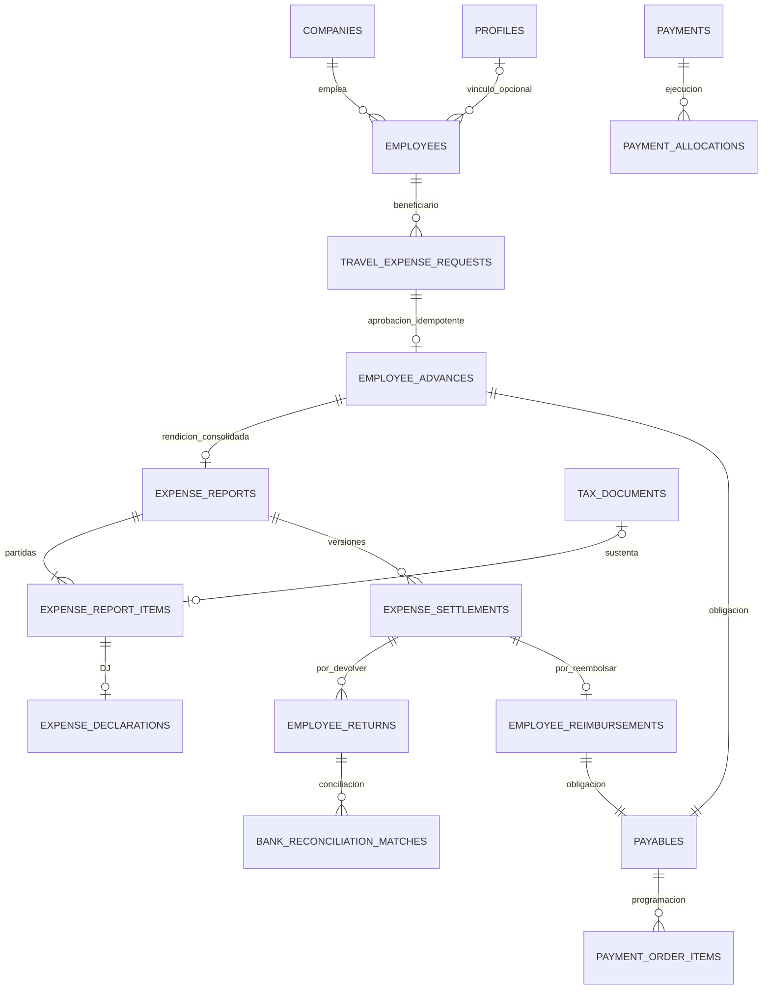

# Fase 6 — viáticos, rendiciones y Tesorería employee

El circuito está implementado. Migraciones **022–032 aplicadas únicamente al Supabase DEV vinculado**, con LOCAL/REMOTE 001–032 coincidentes. La matriz real concluyó con **30 PASS y 0 FAIL**, más **4 pruebas concurrentes DEV PASS** y **2 comprobaciones de UI/impresión PASS**. El estado de validación vigente es [resultado-dev.md](resultado-dev.md) / [resultado-dev.json](resultado-dev.json). No iniciar Fase 7. SMTP conserva la excepción externa previamente aprobada.

## Modelo y migraciones

| Migración | Entidades / cambio |
|---|---|
| 022 | employees, expense_categories, employee_expense_policies, expense_policy_categories |
| 023 | travel_expense_requests, travel_expense_request_items, travel_expense_history |
| 024 | employee_advances, employee_bank_accounts; beneficiario employee tipado en payables/OP/payments |
| 025 | Integración con RPC y recálculo de Tesorería, sin duplicar motor de pagos |
| 026 | Propuesta/aprobación de cuenta employee, enmascarado, identidad protegida |
| 027 | expense_reports, expense_report_items, expense_declarations, expense_report_history, expense_settlements, employee_returns, employee_reimbursements |
| 028 | Creación, partidas, DJ estructurada y revisión individual |
| 029 | Liquidación exacta, cierre/reapertura, reembolso idempotente, derivación por pagos/reversos |
| 030 | tax_documents existente, Storage cifrado existente y protección documental |
| 031 | Devoluciones en conciliación Fase 5, exclusividad payment/employee_return |
| 032 | Opciones, dashboard derivado y cancelación aprobada sin desembolso |

Las migraciones 001–021 se conservan. Todas las entidades nuevas son empresariales, con FK compuesta cuando relacionan filas de una empresa. employee puede existir sin Auth, profile ni membership. profile_id es opcional y no otorga acceso por sí mismo. [Decisiones de compatibilidad](compatibilidad.md).



## Seguridad, RLS y permisos

Identidad Auth validada, profile/sesión activos, membership actual, permiso empresarial y empresa persistida de la fila. Las empresas del payload identifican contexto; no acreditan autorización. RLS limita lectura propia/empresarial; clientes autenticados, anónimos y service no tienen CRUD directo. Mutaciones por RPC allowlist con búsqueda privada, bloqueo de seguridad/Tesorería y auditoría transaccional. No se habilitan grants financieros automáticos al administrador.

Catálogo: employee.view/manage; expense_category.view/manage; expense_policy.view/manage; travel_expense.view_own/view_company/create/create_for_employee/submit/approve/observe/reject/cancel; employee_advance.view/cancel; employee.bank_view/bank_change/bank_change_approve; expense_report.view_own/view_company/create/create_for_employee/submit/review/approve/observe/reject/close/reopen; declaration.create/view/approve; employee_return.view/register/match; employee_reimbursement.view/create/approve. Revisar el catálogo efectivo para recursos reservados activados; no crear permisos desde UI. Tesorería, documentos, auditoría y conciliación siguen exigiendo sus permisos independientes.

## API y RPC

Todas las rutas bajo /api requieren autenticación vigente. Listados usan company_id, page y limit (máximo 100).

| API | RPC principal |
|---|---|
| GET/POST employees; PATCH employees/:id | employee_foundation_save |
| GET/POST expense-categories; PATCH expense-categories/:id | employee_foundation_save |
| GET/POST expense-policies | employee_foundation_save, nueva versión |
| GET/POST employee-bank-accounts; POST :id/decision | employee_bank_list/change/decide |
| GET/POST travel-expenses; GET/PUT :id; POST :id/actions | travel_expense_save/transition |
| POST travel-expenses/:id/cancel-unpaid | travel_cancel_unpaid |
| GET employee-advances | RLS, paginado |
| GET/POST expense-reports; GET :id | expense_report_create / expense_settlement_detail |
| GET/POST expense-reports/:id/items; PUT :id/items/:item | expense_item_save |
| POST expense-reports/:id/actions | expense_report_transition |
| POST expense-items/:id/review | expense_item_review |
| POST expense-items/:id/declaration | expense_declaration_create |
| GET expense-declarations; GET :id; POST :id/decision | expense_declaration_decide |
| POST expense-items/:id/tax-document | expense_tax_document, alta o existing_id |
| POST expense-tax-documents/:id/review | expense_tax_document_review |
| POST expense-settlements/:id/returns | employee_return_register, idempotency_key |
| GET employee-returns; GET :id; POST :id/cancel | employee_return_cancel |
| GET employee-returns/:id/candidates; POST :id/matches | employee_return_candidates/match |
| POST reconciliation-matches/:id/actions | treasury_action, reconcile/unmatch |
| GET employee-reimbursements; GET :id | RLS, paginado |
| GET travel-expenses/:id/history; expense-reports/:id/history | Parent RLS + historia paginada |
| GET employee-expenses/options; /dashboard | expense_options / expense_dashboard |
| GET expense-attachments; POST attachments/upload; GET attachments/:id/download | Storage cifrado existente |

No hay endpoint para asignar paid_amount, saldo, actor, estado de conciliación o totales. Los validadores Zod rechazan esos campos. El backend verifica el resultado aritmético de la RPC con settlement-contract.ts y employee-settlement.ts; la operación atómica y la autorización permanecen en PostgreSQL.

## Flujos

VIA borrador → enviada → aprobada por otro actor. Con anticipo positivo crea employee_advance + payable aprobado, todavía impagado. Cero anticipo permite continuar. Tesorería: OP → aprobación independiente → programación → pago con voucher → executed. El anticipo entregado procede exclusivamente de allocations netas de reversos.

Rendición REN-YYYY-XXXXXX → partidas → sustento/DJ → envío → revisión individual pending/accepted/observed/rejected → aprobación y liquidación. 180/160 crea devolución 20; 180/220 crea reembolso 40; 180/180 no crea diferencias. Aceptación parcial requiere política y motivo. DJ requiere política, categorías y límites; aprobarla no acepta la partida.

Devolución: registered → evidencia cifrada → vincular abono confirmado → matched → reconcile → reconciled. Registrar o vincular no equivale a conciliar. Reembolso: obligación employee → OP → ejecución por Tesorería → conciliación existente. No proveedor ficticio, no pago manual desde rendición.

Cierre: partidas resueltas, documentación válida, anticipo completo y saldos cero. Reapertura: permiso + política + motivo; preserva liquidación anterior y efectos. Deshacer conciliación o pago de reembolso reabre automáticamente el saldo y registra historia. Cancelación de VIA aprobada sólo si política lo permite, sin desembolsos ni efectos activos.

## Storage y representación

Bucket financial-encrypted privado, AES-256-GCM y key_version de Fases 4–5. Tipos adicionales: expense_receipt, tax_support, declaration_support, employee_payment_evidence, employee_return_evidence, employee_reimbursement_support, expense_representation. PDF/XML/PNG/JPEG, máximo 5 MB, validación de extensión/MIME/contenido. Backend autoriza cada entrega de plaintext; nunca expone claves. El acceso al ciphertext no equivale a conocer el documento.

UI real en /app/travel-expenses, expense-reports, employee-advances, expense-declarations, employee-returns, employee-reimbursements y employee-expense-dashboard. Visibilidad por permisos actuales. Imprimir/guardar PDF representa VIA, REN, DJ y liquidación; dimensiones guardadas se usan en el detalle imprimible. Fuente de verdad: BD e historia. No firma digital legal.

## Validación y ejecución

[Puerta local](puerta-local.json): 77 verificaciones PostgreSQL (cinco concurrentes), 37 pruebas aplicación, ocho pruebas Playwright; backend/client typecheck, Vite y secret boundary PASS. [Resultado PostgreSQL](resultado-postgres-local.json). Los resultados DEV se mantienen separados y sus ejecuciones anteriores se archivan en historico.

Node exacto 24.18.0. Variables existentes: SUPABASE_URL, SUPABASE_PUBLISHABLE_KEY, SUPABASE_SECRET_KEY sólo backend/Auth Admin, APP_ORIGIN, PORT, TRUST_PROXY_HOPS, claves ATTACHMENT_ENCRYPTION_KEY/versiones según configuración de Fases 4–5. No cambian los nombres ni se crean secretos frontend. SUPABASE_DB_URL sólo diagnóstico/pruebas SQL; la aplicación no depende de esa conexión ni declara resuelto el antiguo 28P01.

```powershell
npm run test
npm run test:db
npm run typecheck
npm run build
npm run test:e2e
npm run dev
# PostgreSQL desechable local, nunca base existente:
node scripts/phase6-local-postgres.mjs
# Verificación real DEV con guardas, no producción:
node --env-file=.env --import tsx scripts/verify-phase6-dev.ts
```

Para Supabase: verificar que .temp/project-ref coincida con SUPABASE_URL; consultar migraciones-dev.json. 022–032 ya se aplicaron; no ejecutar SQL duplicado ni editar migraciones publicadas. Mantener bucket privado/cifrado y variables backend existentes. Crear roles y grants explícitos mediante administración, memberships por empresa y políticas por moneda; ninguna seed concede finanzas automáticamente. El runner crea exclusivamente fixtures sintéticos y conserva su auditoría. La limpieza inicial interrumpida y su corrección están documentadas en el resultado DEV. No corrige SMTP.

## Recorrido manual

1. Administrador: memberships y roles diferenciados de solicitante, revisor, aprobador financiero y ejecutor. Crear employee con profile opcional, categoría y política por moneda mediante API administrativa autorizada.
2. Solicitante: Mis solicitudes → Nueva solicitud; empleado, moneda, CECO/proyecto, fechas, presupuesto y anticipo. Guardar y enviar. Otro actor aprueba. Comprobar anticipo aprobado con pagado cero.
3. Tesorería: OP beneficiario Colaborador, seleccionar obligación y medio/cuenta aprobada; aprobar con otro actor, programar, cargar voucher y ejecutar. Comprobar pagado derivado.
4. Mis rendiciones: crear desde VIA, cargar gastos, comprobante existente/nuevo o DJ configurada; adjuntar documentos. Revisor resuelve cada partida; aprobador liquida el cálculo.
5. Si sobra dinero, registrar devolución, adjuntar evidencia, vincular abono y conciliar. Si falta, consultar reembolso y pagar su obligación por Tesorería. Verificar saldos antes/después.
6. Cerrar sin saldos. Revisar historial paginado, imprimir/guardar PDF y dashboard. Intentar acceder desde otra empresa, revocar membership con sesión abierta y comprobar rechazo.
7. Reabrir sólo con política/permiso/motivo, resolviendo previamente los efectos financieros. Revisar versiones anteriores. No iniciar Fase 7.

## Incidencias y riesgos

Ver historico para fallos conservados y resultado-dev para estado vigente; no hay FAIL funcional pendiente en DEV. Los formatos impresos no son una firma legal. Una rendición activa consolida un anticipo/VIA; no existen rendiciones parciales múltiples para un mismo anticipo. Montos en una moneda, sin cambio automático. El payable de reembolso agregado no reemplaza el desglose por partida para informes dimensionales. Políticas, cuentas bancarias y grants de operadores reales requieren configuración empresarial; las pruebas no son configuración productiva.


## Archivos principales y cierre de validación

- Modelo/RLS/RPC: supabase/migrations/202609110022…202609120032.
- API: src/server/routes/employee-expenses.ts y expense-reports.ts; integración en routes/api.ts.
- Validación: src/server/validators/employee-expenses.ts y finance.ts.
- Aritmética: src/server/services/employee-settlement.ts y settlement-contract.ts.
- UI: src/client/employee-expenses.tsx, main.tsx, styles.css; beneficiario employee en treasury.tsx.
- Pruebas DB: supabase/tests/phase6-foundation-checks.mjs, phase6-settlement-checks.mjs y phase6-concurrency-checks.mjs.
- Pruebas API/aritmética: tests/app.test.ts y employee-settlement.test.ts.
- Navegador: tests/e2e/employee-expenses.spec.ts; regresión previa interface.spec.ts.
- Ejecución DEV: scripts/phase6-dev-migrations.mjs, verify-phase6-dev.ts, verify-phase6-ui-dev.ts.

[Validación final](validacion-final.json): nueve pruebas UI distintas PASS (seis regresiones y tres de Fase 6). La última prueba añadida comprueba que la DJ impresa conserva declarante, gasto y CECO originales. Se repitieron typecheck cliente, Vite y secret boundary para ese ajuste de representación, sin modificar BD. La puerta anterior a DEV conserva su evidencia original de ocho pruebas UI.
