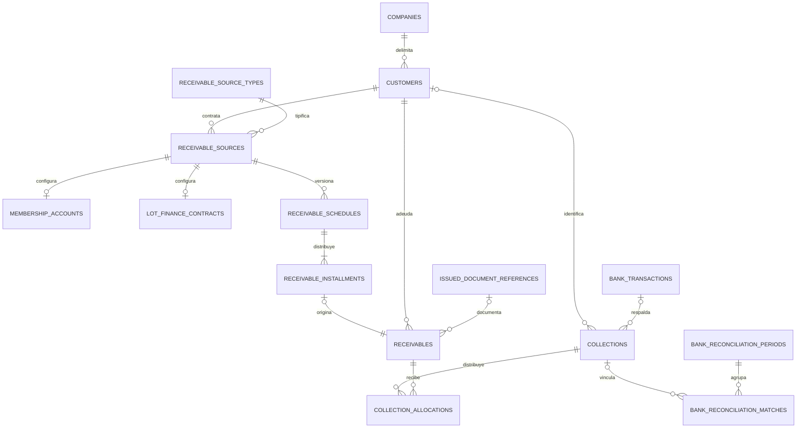

# Modelo y compatibilidad de Fase 7

Las migraciones 033–037 son aditivas respecto de 001–032. No alteran identidad de empleados, solicitudes, CECO, pagos, obligaciones a empleados ni liquidaciones. Extienden la conciliación existente con un tercer destino mutuamente excluyente: cobro, pago o devolución de empleado.

Además: `receivable_history`, `receivable_operation_keys`, vistas `receivable_balances` y `collection_balances`. Todas las entidades de negocio poseen `company_id`; únicamente el catálogo de tipos es global. Clientes naturales/jurídicos no dependen de Auth, profiles ni membership. Documento único por empresa, tipo y número normalizados; identidad usada no editable libremente.

## Importes y estados

Importes persistidos NUMERIC(18,2), positivos donde corresponde. RPC rechazan NaN, importes textuales, precisión excesiva, sobraplicación y referencias cruzadas. `outstanding_amount = original_amount - sum(allocations válidas)`. El estado financiero se deriva de ese saldo y vencimiento; `collected` no es un estado editable. Las CxC conservan únicamente `active/cancelled` como estado administrativo.

El cobro conserva `active/reversed`; se derivan `unidentified/identified/partially_applied/applied/reversed`. Saldo a favor = importe del cobro activo identificado menos aplicaciones válidas. No genera deuda ficticia. Identificar no aplica fondos ni concilia. Una aplicación puede distribuirse entre varias obligaciones del mismo cliente, moneda y empresa, bajo `collection.apply`.

El importe/moneda/fecha de un cobro bancario se obtienen del crédito confirmado persistido. Índice parcial: un solo cobro activo por movimiento. Ese crédito no puede respaldar simultáneamente una devolución de empleado. No se permite excluir evidencia bancaria de un cobro activo.

## Cronogramas y orígenes

`receivable_sources` contiene origen, cliente, moneda, referencia y estado. Las membresías configuran importe, primer vencimiento/inicio, fin opcional y periodicidad en meses. Los vencimientos deben coincidir con inicio más múltiplos de la periodicidad; PostgreSQL ajusta fin de mes. No hay tarifas, mora, renovación ni intereses implícitos. La generación exige cuotas explícitas y evita repetir un vencimiento activo.

Los lotes sólo contienen identificador externo y contrato financiero: precio, inicial y saldo financiado derivado. Las cuotas deben sumar el precio y comenzar con la inicial cuando sea positiva. No hay inventario inmobiliario.

La sustitución de un cronograma requiere motivo y permiso específico, conserva versión anterior como `superseded`, cancela sus obligaciones y genera la nueva versión. Se rechaza si existe cualquier historial de cobros, incluso revertidos. Se conserva el origen al cerrarlo; el cierre impide nueva generación y no condona deuda.

## Seguridad

RLS en todas las tablas, sin INSERT/UPDATE/DELETE directo para authenticated, anon ni service_role. Vistas con `security_invoker`. Las RPC mutadoras usan identidad verificada, profile/sesión activos, membership, permiso empresarial y empresa persistida; ejecutan bajo el bloqueo transaccional compartido de Tesorería. Referencias compuestas impiden cruces empresariales.

No hay grants automáticos. Los roles son globales, su asignación empresarial permanece intacta. Administradores no adquieren ejecución financiera por administrar el catálogo.

Conciliación exige permiso bancario y lectura de cobros. Se excluye al creador, identificadores históricos y autores de aplicaciones. Reidentificar el mismo cliente conserva el actor original. Cambiar cliente con efectos financieros exige resolverlos antes. Un período cerrado exige reapertura; un cobro vinculado exige deshacer su vínculo antes de revertirlo.

Las claves idempotentes se comparan con operación y payload bajo bloqueo; reusar clave con datos distintos falla. Auditoría financiera e historial conservan empresa, actor, motivo y cambios. No se borra historia.

## Documentos y Cash Flow

`issued_document_references` conserva metadata comercial emitida; no reutiliza comprobantes de compra ni certifica SUNAT. `collection_support` y `issued_document` usan attachments existentes, Storage privado y cifrado autenticado; los cobros sin respaldo bancario requieren evidencia lista antes de aplicar.

ACTUAL y posición bancaria siguen usando exclusivamente movimientos confirmados. `expected_receivables` se agrega por vencimiento y moneda como entrada esperada separada. Las aplicaciones no vuelven a sumar dinero bancario. Aging usa saldos vigentes clasificados por vencimiento; no pretende reconstruir una cartera histórica a una fecha pasada.
