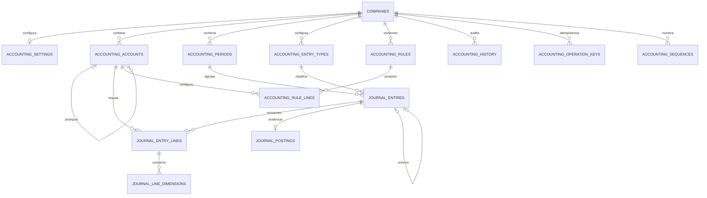

# Fase 8A · núcleo contable

**Matriz Supabase DEV: 34 PASS, 0 FAIL, 4 concurrencias PASS.** Ejecución `F8A_20260914000108`, únicamente con fixtures sintéticos. [Matriz completa](resultado-dev.md), [resultado estructurado](resultado-dev.json) y [migraciones 038–043 verificadas en DEV](migraciones-dev.json). El proyecto vinculado coincide con la aplicación. Las evidencias locales no sustituyen esta matriz.

[Recorrido manual y configuración Supabase](recorrido-manual.md). [Puerta local](puerta-local.json): 107 verificaciones PostgreSQL, 42 pruebas de aplicación y 16 pruebas UI. Incluye regresiones de Fases 1–7, tipos, build y aislamiento de secretos. [Revisión final de interfaz DEV](resultado-ui-dev.json).

Se incorporan plan de cuentas empresarial, importación CSV/XLSX, moneda funcional y numeración explícitas, períodos, tipos de asiento, borradores revisionados, validación, posteo independiente, reversos, dimensiones históricas, reglas versionadas para simulación, mayor y balance de comprobación. No existen cuentas reales ni saldos iniciales sembrados. No se generan asientos automáticamente desde Fases 4–7.

## Revisión de compatibilidad previa al esquema

| Migración | Compatibilidad y control preservado |
|---|---|
| 038 · foundation | Tablas adicionales con `company_id`, claves compuestas, RLS y permisos sin grants. No altera tablas financieras anteriores. |
| 039 · guards | Evidencia de posteo, historia y reglas inmutables; misma exclusión mutua transaccional de Tesorería. No permite DELETE. |
| 040 · masters | RPC exige autorización viva, jerarquía empresarial y protección después del primer uso. Import preview revierte su subtransacción. |
| 041 · journals | Reutiliza monedas, tipos de cambio, empleados, proveedores, clientes y dimensiones existentes. No agrega hooks de generación automática. Primer uso CECO/proyecto transaccional y snapshots. |
| 042 · reports | Vista `security_invoker`; RPC empresarial con permisos específicos. Reportes derivados de evidencia de posteo. |
| 043 · rules | Versiones nuevas y activación segregada solo para simulación. Restricción `production_enabled = false`. Referencia de regla en asiento reservada, no admitida en CRUD normal. |

Las migraciones 001–037 se preservan. Nuevas migraciones autorizadas solamente para el mismo Supabase DEV vinculado a la aplicación, previa puerta local PASS y validación de hashes. Nunca se usa secret key para CRUD de base de datos. El verificador usa Auth Admin exclusivamente para sesiones de prueba; todas las operaciones financieras usan publishable key + JWT.

## Modelo



Las trece tablas nuevas son las mostradas en el diagrama. `accounting_ledger_lines` es una vista, no una tabla de saldos. `journal_entry_lines.revision` conserva versiones de borradores; el asiento referencia su revisión vigente. Las dimensiones guardan identificador y descripción al contabilizar. La identidad y ascendencia de cuentas usadas queda protegida; el nombre puede cambiar sin reemplazar el snapshot del movimiento.

Un asiento reversado **permanece en el mayor junto con su inverso**. Excluir el original al marcarlo `reversed` produciría un saldo incorrecto. `journal_postings` conserva la evidencia inmutable de ambos movimientos y evita que los borradores o simples estados fabricados afecten los reportes.

## API y permisos

Prefijo `/api/accounting`, autenticación normal de la aplicación. `company_id` es contexto a comprobar, nunca autorización. Las RPC resuelven empresa de la fila persistida y verifican perfil, sesión, membership y permiso antes de consultar idempotencia.

| Recurso | Operaciones |
|---|---|
| accounts | GET/POST, PATCH `/:id`, POST `/:id/disable`, POST `/import` |
| periods | GET/POST, POST `/:id/action` con soft_close/close/reopen y motivo |
| settings | POST, PATCH `/:id` |
| entry-types | GET/POST, PATCH `/:id` |
| exchange-rates | POST con compra, venta, contable y fuente explícitos |
| journals | GET/POST, GET `/:id`, POST `/:id/versions`, `/:id/validate`, `/:id/post`, `/:id/reverse` |
| journal-lines | GET `/:id/dimensions` |
| rules | GET/POST, GET `/:id`, POST `/:id/versions`, `/:id/action`, `/:id/preview` |
| reports | POST `/general_ledger`, `/trial_balance` con filtros validados |
| options, history | GET |

`Idempotency-Key` UUID es obligatorio para guardar asientos/reglas, importar, postear y reversar. La misma clave con payload diferente falla. Los validadores son estrictos: actor, estado, totales y snapshots no se aceptan desde cliente.

RPC: `accounting_master_save`, `accounting_account_disable`, `accounting_period_action`, `accounting_exchange_rate_save`, `accounting_account_import`, `journal_save`, `journal_validate`, `journal_post`, `journal_reverse`, `accounting_report`, `accounting_options`, `accounting_rule_save`, `accounting_rule_action`, `accounting_preview`. Los helpers permanecen en `private`, sin EXECUTE para clientes.

Permisos: `accounting_account.view/create/edit/disable/import`, `accounting_period.view/manage/close/reopen`, `journal.view/create/edit_draft/validate/post/reverse`, `accounting_rule.view/create/edit/activate`, `general_ledger.view`, `trial_balance.view`. Configuración, tipos y tasas contables requieren `accounting_period.manage`. No hay asignaciones automáticas a usuarios ni a System Administrator.

## Verificación y ejecución

Node exacto 24.18.0. Variables existentes en `.env`; no se requiere ni se imprime ninguna credencial adicional. La conexión SQL directa de DEV no se declara operativa: se mantiene el diagnóstico histórico 28P01 y se usa CLI vinculada para migraciones.

```powershell
npm run typecheck
npm test
npm run test:db
npm run test:phase8a:postgres
npm run verify:phase8a:local
# Solo cuando puerta-local.json sea PASS y hashes coincidan:
npm run db:phase8a:dev:apply
# El verificador DEV se ejecuta tras comprobar las migraciones remotas:
node --env-file=.env --import tsx scripts/verify-phase8a-dev.ts
npm run dev
```

El runner PostgreSQL crea una base desechable exclusivamente en loopback; nunca acepta una conexión remota. Las regresiones de Fases 1–7 siguen formando parte de la puerta local. SMTP conserva su excepción externa anterior y no se modifica.

## Importación futura desde Ábasoft

No hay importación real ni equivalencia PCGE inventada. El adaptador requiere columnas explícitas: `code`, `name`, `parent_code`, `account_type`, `normal_balance`, `allows_posting`, `requires_cost_center`, `requires_project`, `requires_third_party`, `active`, `valid_from`, `valid_to`, `pcge_reference_code`. La empresa se selecciona fuera del archivo. Los códigos se almacenan como texto para preservar ceros. Fechas ISO; booleanos true/false; no fórmulas. El padre no se deduce del número de dígitos. Máximo 2.000 filas y 5 MB por archivo en UI.

Para asientos históricos futuros se necesitarán número externo, fecha, empresa, período, tipo, moneda, tasa y fuente, referencias de origen, líneas con cuenta/debe/haber, tercero y dimensiones. Se debe acordar el mapeo con el catálogo real antes de importar; esta fase no carga esos asientos.

## Alcances y decisiones

- Importes de esta implementación: NUMERIC(18,2), FX NUMERIC(24,12), conversión exacta. Rechaza redondeo implícito. La configuración inicial exige monedas de dos decimales; otras precisiones requieren ampliar el contrato antes de operar.
- `area` sigue siendo catálogo organizativo global de las fases anteriores. La dimensión del movimiento siempre pertenece a su empresa y conserva snapshot. AFE no se implementa todavía.
- Segregación: el creador no postea su asiento; quien posteó el original no ejecuta su reverso; el autor no activa su regla. No se debilitan controles para obtener PASS.
- Mayor expresa saldo como debe menos haber; naturalezas acreedoras pueden aparecer negativas. Rollup del balance agrega ascendientes y no debe sumarse nuevamente junto con sus hijos.
- No hay un saldo editable, asientos automáticos, contabilización masiva productiva, cierre anual de Fase 9 ni Fase 8B.
- Antes de uso real: recibir y validar el plan de cuentas de la empresa, el mapeo Ábasoft, moneda, tipos, períodos, política de redondeo y segregación. Las cuentas de verificación son exclusivamente sintéticas. Los períodos contables no reemplazan el cierre anual de una fase posterior.

## Incidencias resueltas y pendientes

1. Se corrigió localmente el caso `confirm = NULL`: una RPC directa no puede confundir preview con persistencia. La prueba comprueba rechazo y ausencia de filas. Preview informa duplicados y otras inconsistencias sin exponer errores SQL crudos ni permitir confirmar el lote inválido.
2. La primera ejecución DEV falló al intentar crear un colaborador sintético sin su área obligatoria. Se corrigió el fixture con un área sintética, sin cambiar Fase 6 ni sus controles. El resultado anterior se conserva en `historico`; el estado actual es la nueva matriz de 34 PASS.
3. Se corrigieron etiquetas accesibles de los selects detectadas por pruebas de navegador. CSV/XLSX preservan códigos como texto y rechazan fórmulas e identificadores numéricos ambiguos.
4. La evidencia local tiene control de antigüedad. Al superar una hora se repite PostgreSQL desechable antes de regenerar la puerta; no se sustituye por un PASS manual.
5. SMTP/callback conserva su excepción externa aceptada. La conexión SQL directa mantiene su diagnóstico histórico 28P01; la aplicación de migraciones se verifica con CLI. Ninguno se declara corregido.

No existe un FAIL crítico abierto en la matriz DEV. No se inicia Fase 8B ni se activan reglas productivas o generación automática de asientos.
